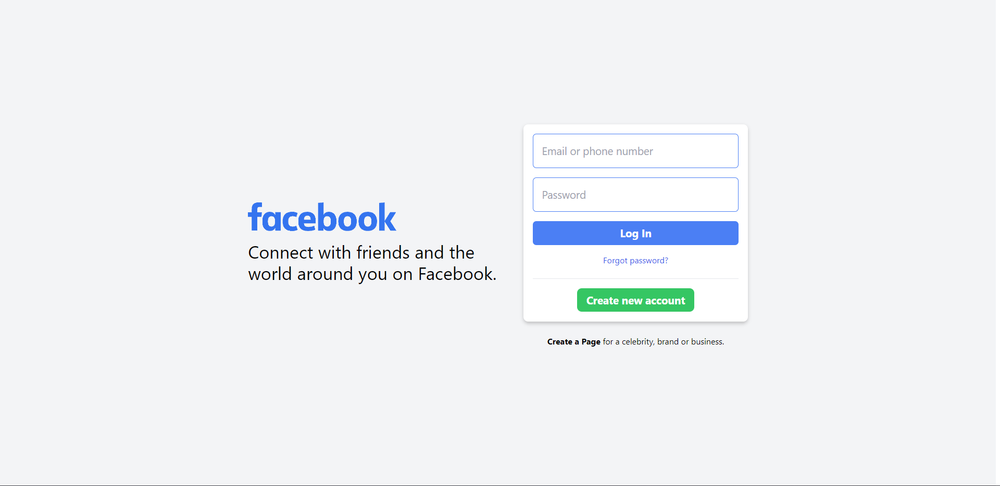
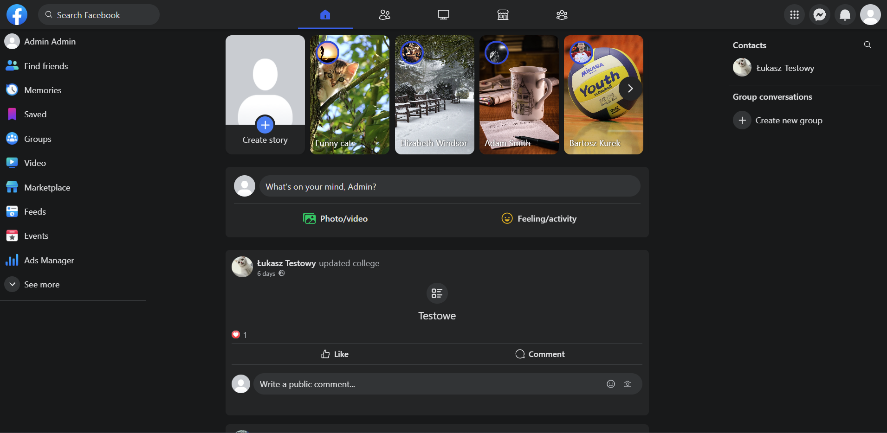
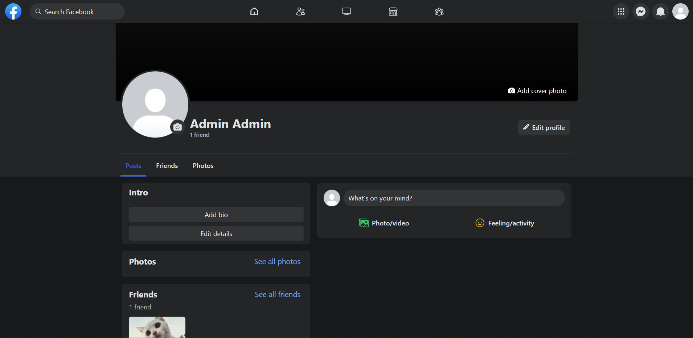
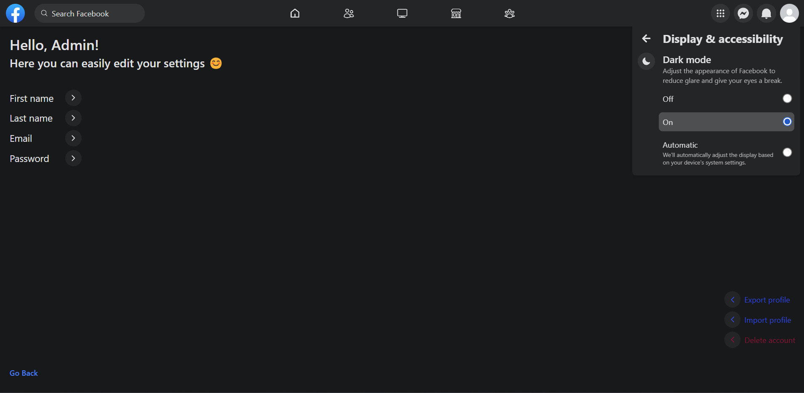

# Facebook Clone

Full stack Facebook clone built using the MERN stack that allows you to communicate with friends around the world

## Contents

- [Documentation](#documentation)
- [App Preview](#app-preview)
- [Overview](#overview)
  - [Features](#features)
  - [Technologies Used](#technologies-used)
- [Run Locally](#get-repository)

### [Documentation](https://github.com/lucasfsn/fb-clone-ug/tree/main/documentation)

### App Preview






## Overview

### Features

- Login and registration
- Profile: View and edit user profile
- Friends: Manage the user's friends list, send friend requests
- Pictures: View, add and delete photos
- Post: Create, edit and delete posts, add and remove reaction, add and delete comment
- Search: Search for users in the application
- Settings: Manage user and application settings (dark and light mode)

### Technologies Used


## Get repository

Clone the project

```bash
  git clone https://github.com/lucasfsn/facebook-clone
```

Go to the project directory

```bash
  cd facebook-clone
```

Go to the client directory

```bash
  cd client
```

Create .env file

```bash
  touch .env
```

.env must contain the following variables:

- VITE_BACKEND_API_URL=your_backend_api_url
- VITE_KEYCLOAK_TOKEN_ENDPOINT=your_keycloak_token_endpoint_url
- VITE_KEYCLOAK_CLIENT_ID=your_keycloak_client_id
- VITE_KEYCLOAK_SECRET=your_keycloak_secret

Go to the k8s directory

```bash
  cd k8s
```

Create backend-secrets.yml

```bash
  apiVersion: v1
  kind: Secret
  metadata:
    name: backend-secrets
    labels:
      app: facebook-clone
  data:
    MONGO_CONNECTION_STRING: your_mongo_connection_string
    CLIENT_SECRET: your_client_secret
    CLOUDINARY_CLOUD_NAME: your_cloudinary_cloud_name
    CLOUDINARY_API_KEY: your_cloudinary_api_key
    CLOUDINARY_API_SECRET: your_cloudinary_api_secret
    KEYCLOAK_REALM: your_keycloak_realm
    KEYCLOAK_AUTH_URL: your_keycloak_auth_url
    KEYCLOAK_CLIENT_ID: your_keycloak_client_id
```

Run locally

```bash
  1. minikube start --memory 4096 --disk-size 10g --cpus 2
  2. minikube apply -f .
  3. kubectl get pods -n ingress-nginx (copy ingress-nginx-controller pod full name)
  4. Add your ingress custom host names to your system configuration
  5. kubectl -n ingress-nginx port-forward pod/pod-name-from-point-3 --address 0.0.0.0 80:80 443:443
```

Login to [keycloak](http://keycloak.facebook-clone.com)

```bash
  username: keycloak
  password: keycloak
```

Set those things in keycloak

```bask
  Create realm with name: facebook-clone
  Create client with id: keycloak
  Client authentication: ON
  Standard Flow: ON
  Direct access grants: ON
  Service accounts roles: ON
  Anything else: OFF
  Web origins: http://facebook-clone.com
```

## Author

- GitHub - [@lucasfsn](https://github.com/lucasfsn)
